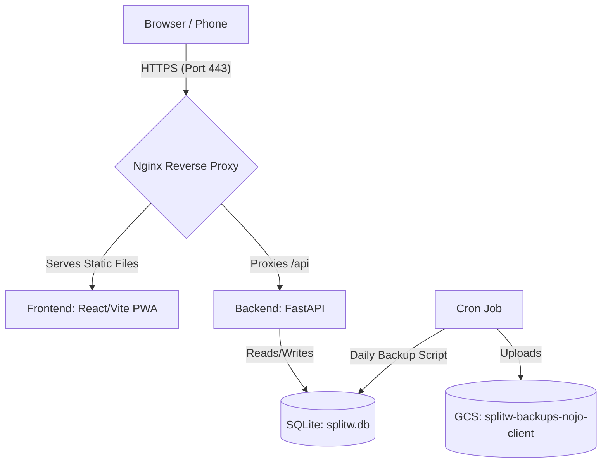

# splitw — Deployment Documentation

This document provides a comprehensive guide to the hosting architecture, system configurations, and redeployment workflows for the **splitw** production deployment.

---

## Architecture Overview

The application is deployed on a single, free-tier virtual machine on **Google Cloud Platform (GCP)**.



*   **Frontend**: React/Vite PWA, built locally on the developer machine (targeting the production API) and served as static assets by Nginx.
*   **Backend**: FastAPI (Python 3), running locally on the VM on port `8000`, managed by `systemd`.
*   **Database**: SQLite (`splitw.db`), stored persistently in the backend directory on the VM.
*   **Backups**: Daily automated backups of `splitw.db` uploaded to a Google Cloud Storage (GCS) bucket with a 30-day retention policy.
*   **Reverse Proxy & SSL**: Nginx, configured with an SSL certificate from **Let's Encrypt** (via Certbot) to handle HTTPS traffic on port 443 and automatically redirect all HTTP traffic (port 80) to HTTPS.
*   **Domain**: `splitw.duckdns.org` (pointing to the VM's external IP).

---

## VM Instance Details

*   **GCP Project**: `nojo-client`
*   **Instance Name**: `splitw-vm`
*   **Zone**: `us-central1-a`
*   **Machine Type**: `e2-micro` (Eligible for GCP's Always Free Tier)
*   **Operating System**: Debian 12 (Bookworm)
*   **External IP**: `34.45.201.52`
*   **Domain**: [https://splitw.duckdns.org](https://splitw.duckdns.org)
*   **Firewall Tags**: `http-server` (port 80), `https-server` (port 443)

---

## Redeployment Workflows

To simplify deployments and prevent the resource-constrained VM (1GB RAM) from freezing during frontend compilation, we use a local build-and-sync strategy. 

An automated deployment script [deploy.sh](file:///usr/local/google/home/willyn/repos/splitw/deploy.sh) is provided in the root of the repository.

### Using the Deployment Script

Run the script from the **root of your local repository**:

```bash
# Make the script executable (one-time setup)
chmod +x deploy.sh

# Deploy everything (Frontend + Backend)
./deploy.sh

# Deploy Frontend only (UI changes, styles, etc.)
./deploy.sh frontend

# Deploy Backend only (API updates, schemas, etc.)
./deploy.sh backend
```

### Under the Hood (What the script does)

*   **Frontend Deployment**: Builds the React/Vite PWA locally (`npm run build`), clears the old `~/dist` directory on the VM, uploads the new build via `scp`, and ensures Nginx has read permissions (`chmod 755`).
*   **Backend Deployment**: Packages the `backend` directory into a tarball (excluding virtual envs, databases, and caches), uploads it, extracts it on the VM (overwriting old files), and restarts the `splitw-backend` systemd service.

---

## 🗄️ Production Database Migrations

We use **Alembic** to manage database schema changes. 

### Automated Migrations on Deploy
The [deploy.sh](file:///usr/local/google/home/willyn/repos/splitw/deploy.sh) script is configured to automatically run database migrations on the VM every time you deploy the backend. 
During `./deploy.sh backend` (or `./deploy.sh all`):
1. The new code and migration scripts are uploaded.
2. The script runs `venv/bin/alembic upgrade head` on the VM to apply any pending migrations.
3. The backend service is restarted.

### ⚠️ One-Time Transition Step (Stamping)
If you are deploying Alembic to an **existing production database** for the first time (where tables already exist but the database has no migration history), you **must** stamp the database first. 

If you do not do this, the first deployment will fail because Alembic will try to run the `baseline` migration (creating tables) and fail because the tables already exist.

To perform this transition safely without losing data:

1. **Deploy the backend** (this uploads the Alembic files):
   ```bash
   ./deploy.sh backend
   ```
2. **Stamp the database** at the baseline revision (`79eaee45e12c`). Run this from your **local machine**:
   ```bash
   gcloud compute ssh splitw-vm --zone=us-central1-a --project=nojo-client --command="cd /home/willyn/backend && venv/bin/alembic stamp 79eaee45e12c"
   ```
3. **Apply the pending migrations**: This will apply only the new migrations (like adding the `emoji` column) without touching your existing tables. Run this from your **local machine**:
   ```bash
   gcloud compute ssh splitw-vm --zone=us-central1-a --project=nojo-client --command="cd /home/willyn/backend && venv/bin/alembic upgrade head"
   ```
4. **Restart the backend**:
   ```bash
   gcloud compute ssh splitw-vm --zone=us-central1-a --project=nojo-client --command="sudo systemctl restart splitw-backend"
   ```

Once this transition is complete, all future deployments will handle migrations automatically!

---

## System Configurations (On the VM)

For reference, here are the configurations active on the virtual machine.

### 1. Nginx Configuration
Located at `/etc/nginx/sites-available/default` (managed by Certbot for SSL):

```nginx
server {
    root /home/willyn/dist;
    index index.html;
    server_name splitw.duckdns.org;

    # Frontend Static Files & SPA Routing
    location / {
        try_files $uri $uri/ /index.html;
    }

    # Backend API Reverse Proxy
    location /api {
        proxy_pass http://127.0.0.1:8000;
        proxy_http_version 1.1;
        proxy_set_header Upgrade $http_upgrade;
        proxy_set_header Connection 'upgrade';
        proxy_set_header Host $host;
        proxy_cache_bypass $http_upgrade;
    }

    listen [::]:443 ssl ipv6only=on;
    listen 443 ssl;
    ssl_certificate /etc/letsencrypt/live/splitw.duckdns.org/fullchain.pem;
    ssl_certificate_key /etc/letsencrypt/live/splitw.duckdns.org/privkey.pem;
    include /etc/letsencrypt/options-ssl-nginx.conf;
    ssl_dhparam /etc/letsencrypt/ssl-dhparams.pem;
}

# Automatic HTTP to HTTPS Redirect
server {
    if ($host = splitw.duckdns.org) {
        return 301 https://$host$request_uri;
    }
    listen 80;
    listen [::]:80;
    server_name splitw.duckdns.org;
    return 404;
}
```

### 2. Systemd Backend Service
Located at `/etc/systemd/system/splitw-backend.service`:

```ini
[Unit]
Description=splitw FastAPI Backend
After=network.target

[Service]
User=willyn
WorkingDirectory=/home/willyn/backend
ExecStart=/home/willyn/backend/venv/bin/uvicorn app.main:app --host 127.0.0.1 --port 8000
Restart=always

[Install]
WantedBy=multi-user.target
```

---

## Troubleshooting & Maintenance Commands

You can run these commands from your **local machine** to check the status of the live server:

*   **Check Backend Logs (Live Stream)**:
    ```bash
    gcloud compute ssh splitw-vm --zone=us-central1-a --command="sudo journalctl -u splitw-backend -f"
    ```
*   **Check Nginx Error Logs**:
    ```bash
    gcloud compute ssh splitw-vm --zone=us-central1-a --command="sudo tail -n 50 /var/log/nginx/error.log"
    ```
*   **Restart Backend Service**:
    ```bash
    gcloud compute ssh splitw-vm --zone=us-central1-a --command="sudo systemctl restart splitw-backend"
    ```
*   **Restart Nginx**:
    ```bash
    gcloud compute ssh splitw-vm --zone=us-central1-a --command="sudo systemctl restart nginx"
    ```

---

## Database Backups & Recovery

To prevent data loss, we have implemented an automated daily backup system that copies the SQLite database to Google Cloud Storage (GCS).

### 1. GCS Bucket Setup
The backups are stored in a GCS bucket named `splitw-backups-nojo-client` in the `us-central1` region.

To recreate the bucket or set it up initially:
```bash
# 1. Create the bucket
gcloud storage buckets create gs://splitw-backups-nojo-client --location=us-central1 --project=nojo-client

# 2. Set a lifecycle policy to automatically delete backups older than 30 days (to minimize costs)
# Create a lifecycle.json file:
# {
#   "rule": [
#     {
#       "action": {"type": "Delete"},
#       "condition": {"age": 30}
#     }
#   ]
# }
gcloud storage buckets update gs://splitw-backups-nojo-client --lifecycle-file=lifecycle.json
```

> [!IMPORTANT]
> The VM's Service Account (or the default Compute Engine service account) must have the **Storage Object Creator** (or **Storage Admin**) role on this bucket to allow the backup script to upload files.

### 2. Backup Script
The backup script is located at [backup.sh](file:///usr/local/google/home/willyn/repos/splitw/backend/scripts/backup.sh) in the repository. It:
1. Uses `sqlite3`'s `.backup` command to safely copy the database even if writes are occurring.
2. Uploads the timestamped backup to `gs://splitw-backups-nojo-client/daily/`.
3. Cleans up the temporary local backup file.

When you redeploy the backend, this script is automatically uploaded to `/home/willyn/backend/scripts/backup.sh`.

### 3. Automating with Cron
To run the backup daily at 2:00 AM VM time:

1. SSH into the VM:
   ```bash
   gcloud compute ssh splitw-vm --zone=us-central1-a
   ```
2. Make sure the script is executable:
   ```bash
   chmod +x /home/willyn/backend/scripts/backup.sh
   ```
3. Open the crontab editor:
   ```bash
   crontab -e
   ```
4. Add the following line at the bottom of the file:
   ```cron
   0 2 * * * /home/willyn/backend/scripts/backup.sh >> /home/willyn/backend/backups/backup.log 2>&1
   ```
5. Save and exit. The backup will now run daily, and logs will be written to `/home/willyn/backend/backups/backup.log`.

### 4. How to Restore from a Backup
If you need to restore the database to a previous state:

1. SSH into the VM:
   ```bash
   gcloud compute ssh splitw-vm --zone=us-central1-a
   ```
2. Stop the backend service to prevent writes:
   ```bash
   sudo systemctl stop splitw-backend
   ```
3. Locate the backup you want to restore in GCS:
   ```bash
   gcloud storage ls gs://splitw-backups-nojo-client/daily/
   ```
4. Download the desired backup (replacing the placeholder with the actual filename):
   ```bash
   gcloud storage cp gs://splitw-backups-nojo-client/daily/splitw_backup_YYYYMMDD_HHMMSS.db /home/willyn/backend/splitw.db
   ```
5. Ensure correct permissions on the restored database:
   ```bash
   chown willyn:willyn /home/willyn/backend/splitw.db
   chmod 644 /home/willyn/backend/splitw.db
   ```
6. Restart the backend service:
   ```bash
   sudo systemctl start splitw-backend
   ```

