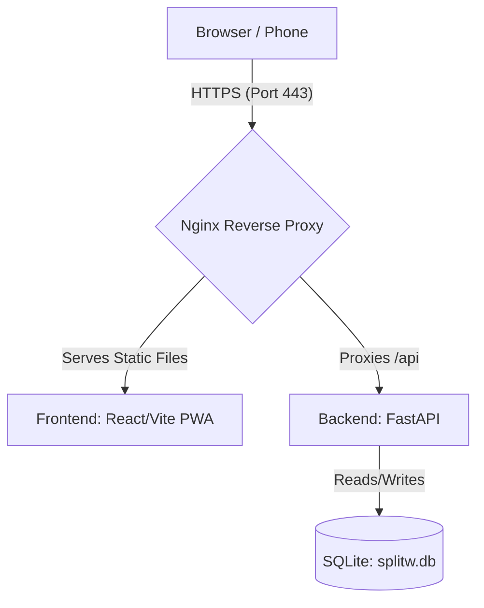

# splitw — Deployment Documentation

This document provides a comprehensive guide to the hosting architecture, system configurations, and redeployment workflows for the **splitw** production deployment.

---

## Architecture Overview

The application is deployed on a single, free-tier virtual machine on **Google Cloud Platform (GCP)**.



*   **Frontend**: React/Vite PWA, built locally on the developer machine (targeting the production API) and served as static assets by Nginx.
*   **Backend**: FastAPI (Python 3), running locally on the VM on port `8000`, managed by `systemd`.
*   **Database**: SQLite (`splitw.db`), stored persistently in the backend directory on the VM.
*   **Reverse Proxy & SSL**: Nginx, configured with an SSL certificate from **Let's Encrypt** (via Certbot) to handle HTTPS traffic on port 443 and automatically redirect all HTTP traffic (port 80) to HTTPS.
*   **Domain**: `splitw.duckdns.org` (pointing to the VM's external IP).

---

## VM Instance Details

*   **GCP Project**: `nojo-client`
*   **Instance Name**: `splitw-vm`
*   **Zone**: `us-central1-a`
*   **Machine Type**: `e2-micro` (Eligible for GCP's Always Free Tier)
*   **Operating System**: Debian 12 (Bookworm)
*   **External IP**: `34.45.201.52`
*   **Domain**: [https://splitw.duckdns.org](https://splitw.duckdns.org)
*   **Firewall Tags**: `http-server` (port 80), `https-server` (port 443)

---

## Redeployment Workflows

Since the VM has limited resources (1GB RAM), **always build the frontend locally** on your development machine to prevent the VM from freezing during compilation.

Run these commands from the **root of your local repository**:

### 1. Redeploy Frontend Only
Use this command when you make UI changes, text edits, or frontend logic updates:

```bash
# 1. Rebuild the frontend locally using production env
npm --prefix frontend run build && \
# 2. Clean the old folder on the VM to prevent nested directory traps
gcloud compute ssh splitw-vm --zone=us-central1-a --command="rm -rf ~/dist" && \
# 3. Upload the new build to the VM
gcloud compute scp --recurse frontend/dist splitw-vm:~ --zone=us-central1-a && \
# 4. Ensure Nginx has permissions to read the new files
gcloud compute ssh splitw-vm --zone=us-central1-a --command="chmod -R 755 ~/dist"
```

### 2. Redeploy Backend Only
Use this command when you update backend APIs, schemas, or database logic:

```bash
# 1. Package the backend locally (excluding virtual envs, databases, and caches)
tar -czf backend.tar.gz --exclude='venv' --exclude='__pycache__' --exclude='*.db' --exclude='jwt_secret.txt' --exclude='.pytest_cache' backend && \
# 2. Upload the package to the VM
gcloud compute scp backend.tar.gz splitw-vm:~ --zone=us-central1-a && \
# 3. Extract the package on the VM, overwrite files, and clean up the tarball
gcloud compute ssh splitw-vm --zone=us-central1-a --command="tar -xzf backend.tar.gz && rm backend.tar.gz" && \
# 4. Restart the backend service to apply changes
gcloud compute ssh splitw-vm --zone=us-central1-a --command="sudo systemctl restart splitw-backend" && \
# 5. Clean up the local temporary tarball
rm backend.tar.gz
```

---

## System Configurations (On the VM)

For reference, here are the configurations active on the virtual machine.

### 1. Nginx Configuration
Located at `/etc/nginx/sites-available/default` (managed by Certbot for SSL):

```nginx
server {
    root /home/willyn/dist;
    index index.html;
    server_name splitw.duckdns.org;

    # Frontend Static Files & SPA Routing
    location / {
        try_files $uri $uri/ /index.html;
    }

    # Backend API Reverse Proxy
    location /api {
        proxy_pass http://127.0.0.1:8000;
        proxy_http_version 1.1;
        proxy_set_header Upgrade $http_upgrade;
        proxy_set_header Connection 'upgrade';
        proxy_set_header Host $host;
        proxy_cache_bypass $http_upgrade;
    }

    listen [::]:443 ssl ipv6only=on;
    listen 443 ssl;
    ssl_certificate /etc/letsencrypt/live/splitw.duckdns.org/fullchain.pem;
    ssl_certificate_key /etc/letsencrypt/live/splitw.duckdns.org/privkey.pem;
    include /etc/letsencrypt/options-ssl-nginx.conf;
    ssl_dhparam /etc/letsencrypt/ssl-dhparams.pem;
}

# Automatic HTTP to HTTPS Redirect
server {
    if ($host = splitw.duckdns.org) {
        return 301 https://$host$request_uri;
    }
    listen 80;
    listen [::]:80;
    server_name splitw.duckdns.org;
    return 404;
}
```

### 2. Systemd Backend Service
Located at `/etc/systemd/system/splitw-backend.service`:

```ini
[Unit]
Description=splitw FastAPI Backend
After=network.target

[Service]
User=willyn
WorkingDirectory=/home/willyn/backend
ExecStart=/home/willyn/backend/venv/bin/uvicorn app.main:app --host 127.0.0.1 --port 8000
Restart=always

[Install]
WantedBy=multi-user.target
```

---

## Troubleshooting & Maintenance Commands

You can run these commands from your **local machine** to check the status of the live server:

*   **Check Backend Logs (Live Stream)**:
    ```bash
    gcloud compute ssh splitw-vm --zone=us-central1-a --command="sudo journalctl -u splitw-backend -f"
    ```
*   **Check Nginx Error Logs**:
    ```bash
    gcloud compute ssh splitw-vm --zone=us-central1-a --command="sudo tail -n 50 /var/log/nginx/error.log"
    ```
*   **Restart Backend Service**:
    ```bash
    gcloud compute ssh splitw-vm --zone=us-central1-a --command="sudo systemctl restart splitw-backend"
    ```
*   **Restart Nginx**:
    ```bash
    gcloud compute ssh splitw-vm --zone=us-central1-a --command="sudo systemctl restart nginx"
    ```
