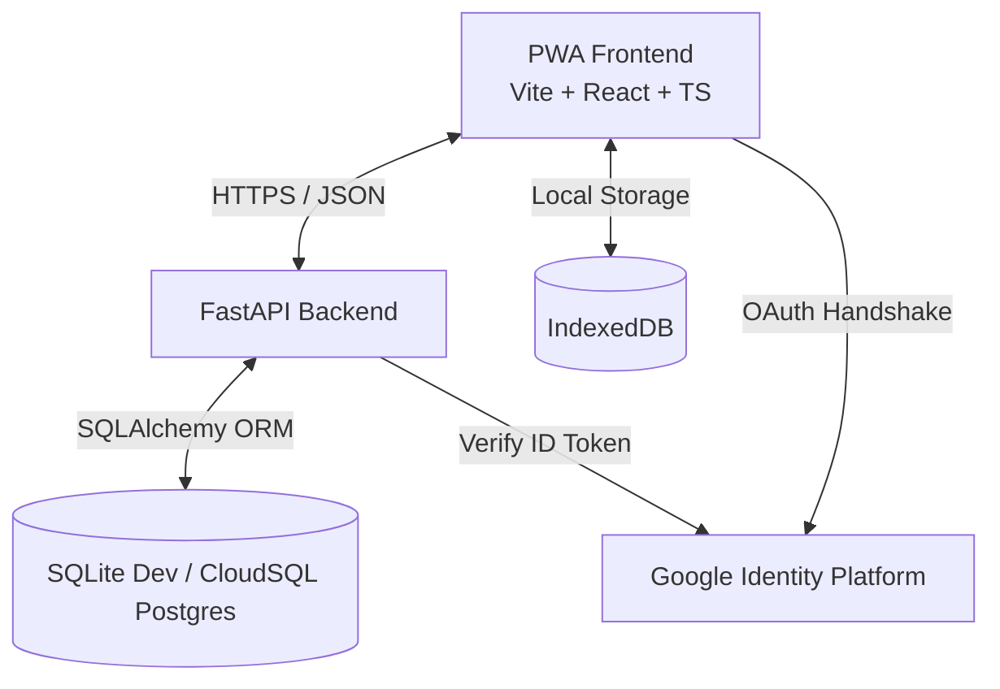
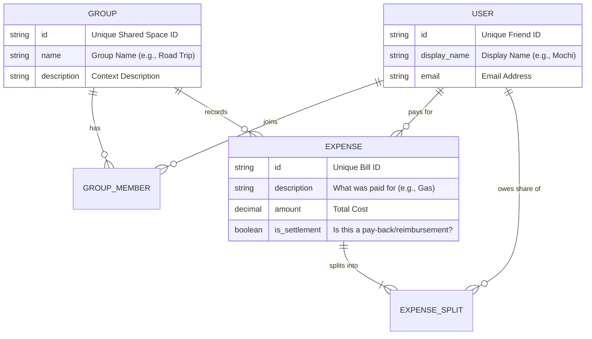

# splitw

A web app designed to settle shared expenses and simplify peer-to-peer debts between friends. Built as a free, responsive alternative to commercial split-expense tools.

---

## Architecture Overview

`splitw` is designed using standard client-server architecture.



### Tech Stack
- **Frontend**: **React + TypeScript + Vite**
- **Styling**: **Vanilla CSS**
- **Offline Storage**: **IndexedDB** (leveraging `Dexie.js`)
- **Backend**: **FastAPI**
- **Database Layer**: **SQLAlchemy ORM** + **Alembic Migrations**.
  - Local developer setup uses **SQLite** for rapid testing, while production uses **Google Cloud SQL (PostgreSQL)**.

---

## Core Architectural Patterns

### 1. Offline-First & Bidirectional Sync Engine
The app operates entirely offline by default. All database entities utilize client-generated **UUIDv4** strings.

- **Status Tracking**: Every table in IndexedDB mirrors the backend schema but appends a `_sync_status`.
- **Reconciliation Protocol**:
  - **Push Phase**: When connection is restored, the client pushes all records where `_sync_status != 'synced'`. The backend processes updates idempotently.
  - **Pull Phase**: The client requests new changes and merges them locally. Soft-deleted items are purged as well.

### 2. Greedy Debt Simplification Algorithm
To minimize the amount of transactions within a group, a greedy matching algorithm is used:

1. **Balance Calculation**:
   $$\text{Balance}(User) = \sum (\text{Paid by User}) - \sum (\text{Owed by User in splits})$$
2. **Grouping**: Members are grouped into **Debtors** (net balance $< 0$) and **Creditors** (net balance $> 0$).
3. **Matching**: We sort both groups and greedily match the largest debtor with the largest creditor. We settle the minimum of their absolute balances, update their balances, and repeat the process until all balances are cleared to 0.
   - *Example*: If Poot owes Mochi $10 and Mochi owes Ptarmi $10, the algorithm simplifies this transaction so Poot pays Ptarmi $10, reducing the transaction count from two to one.

### 3. Database Schema Design

To keep the codebase approachable for everyone, `splitw` organizes its data using a highly intuitive, visual model that mirrors real-world group splitting concepts:



Here is how each entity works:

#### 1. Friends (Users)
Each person using `splitw` has a profile. This holds basic information to identify them and connect them with friends.

| Field Name | What it is | Purpose / Meaning | Real-World Example |
| :--- | :--- | :--- | :--- |
| **Friend ID** | Unique Code | A unique automatically generated identifier for each person. | `usr_9876` |
| **Display Name** | Text | The friendly name shown throughout the app. | `Mochi` |
| **Email Address** | Text | The email address linked to their Google account. | `mochi@example.com` |
| **Profile Picture** | Link (URL) | Optional link to their Google profile picture. | `https://.../mochi.jpg` |

#### 2. Shared Spaces (Groups)
A "Shared Space" is a distinct workspace where you and specific friends share expenses.

| Field Name | What it is | Purpose / Meaning | Real-World Example |
| :--- | :--- | :--- | :--- |
| **Group ID** | Unique Code | A unique identifier representing this specific shared space. | `grp_1234` |
| **Group Name** | Text | The name of the shared space. | `Tokyo Road Trip 2026` |
| **Description** | Text | A brief note about what this group is for. | `Expenses for hotel, food, and gas.` |

#### 3. Group Members (Who's In Where)
This connects friends to the shared spaces they belong to. A friend can be in multiple shared spaces, and a shared space can have many friends.

| Field Name | What it is | Purpose / Meaning |
| :--- | :--- | :--- |
| **Group ID** | Unique Code | The code of the shared space. |
| **Friend ID** | Unique Code | The code of the friend who is part of this space. |
| **Joined Date** | Date & Time | When this friend was added to the space. |

#### 4. Expenses & Pay-Backs (Bills & Settlements)
An expense represents a payment made by someone (e.g., Mochi paid $100 for a group dinner). This table also tracks **Pay-Backs (Settlements)** (e.g., Poot paid Mochi $20 to settle up), which are marked with a special "Pay-Back" flag.

| Field Name | What it is | Purpose / Meaning | Real-World Example |
| :--- | :--- | :--- | :--- |
| **Expense ID** | Unique Code | A unique code for this specific bill. | `exp_555` |
| **Shared Space** | Unique Code | The group this bill belongs to. | `grp_1234` |
| **Paid By** | Unique Code | The friend who actually paid the money upfront. | `usr_9876` (Mochi) |
| **Description** | Text | A short note of what the payment was for. | `Tokyo Tower Tickets` |
| **Total Amount** | Number (Decimal) | The total cost of the bill. | `$60.00` |
| **Currency** | Code (3-letter) | The currency code. | `USD` |
| **Date** | Date & Time | When the expense happened. | `2026-05-16` |
| **Is Pay-Back?** | Yes / No | Set to **Yes** if this is a debt repayment between two people rather than a shared bill. | `No` |
| **Is Deleted?** | Yes / No | Set to **Yes** if the bill has been deleted. | `No` |

#### 5. Expense Splits (Who Owes What)
When a bill is added, it is divided among the participating friends. The splits define exactly how much each person owes.

| Field Name | What it is | Purpose / Meaning | Real-World Example |
| :--- | :--- | :--- | :--- |
| **Expense ID** | Unique Code | The code of the bill being split. | `exp_555` |
| **Friend ID** | Unique Code | The friend who owes a share of this bill. | `usr_1111` (Poot) |
| **Owed Amount** | Number (Decimal) | The exact dollar amount that this person owes. | `$30.00` |

<details>
<summary>View Technical SQL Database Schema</summary>

```sql
-- 1. Users: Profile mapping
CREATE TABLE users (
    id VARCHAR(36) PRIMARY KEY,
    google_id VARCHAR(255) UNIQUE NOT NULL,
    email VARCHAR(255) UNIQUE NOT NULL,
    display_name VARCHAR(255) NOT NULL,
    avatar_url TEXT,
    created_at TIMESTAMPTZ NOT NULL,
    updated_at TIMESTAMPTZ NOT NULL
);

-- 2. Groups: Expense contexts
CREATE TABLE groups (
    id VARCHAR(36) PRIMARY KEY,
    name VARCHAR(255) NOT NULL,
    description TEXT,
    created_at TIMESTAMPTZ NOT NULL,
    updated_at TIMESTAMPTZ NOT NULL
);

-- 3. Group Members: Many-to-Many Association Table
CREATE TABLE group_members (
    group_id VARCHAR(36) REFERENCES groups(id) ON DELETE CASCADE,
    user_id VARCHAR(36) REFERENCES users(id) ON DELETE CASCADE,
    joined_at TIMESTAMPTZ NOT NULL,
    PRIMARY KEY (group_id, user_id)
);

-- 4. Expenses: Transactions (Settlements mapped via is_settlement = TRUE)
CREATE TABLE expenses (
    id VARCHAR(36) PRIMARY KEY,
    group_id VARCHAR(36) REFERENCES groups(id) ON DELETE CASCADE,
    paid_by_id VARCHAR(36) REFERENCES users(id) ON DELETE RESTRICT,
    description VARCHAR(255) NOT NULL,
    amount NUMERIC(12, 2) NOT NULL,
    currency VARCHAR(10) NOT NULL DEFAULT 'USD',
    date TIMESTAMPTZ NOT NULL,
    is_settlement BOOLEAN NOT NULL DEFAULT FALSE,
    is_deleted BOOLEAN NOT NULL DEFAULT FALSE,
    created_at TIMESTAMPTZ NOT NULL,
    updated_at TIMESTAMPTZ NOT NULL
);

-- 5. Expense Splits: Exact monetary shares per user
CREATE TABLE expense_splits (
    expense_id VARCHAR(36) REFERENCES expenses(id) ON DELETE CASCADE,
    user_id VARCHAR(36) REFERENCES users(id) ON DELETE CASCADE,
    owed_amount NUMERIC(12, 2) NOT NULL,
    PRIMARY KEY (expense_id, user_id)
);
```

</details>

---

## 🚀 Local Quickstart

### Backend Setup

1. Ensure you have Python 3.13+ installed.
2. Navigate to the backend directory and set up the virtual environment:
   ```bash
   cd backend
   python3 -m venv venv
   source venv/bin/activate
   ```
3. Install all dependencies:
   ```bash
   pip install -r requirements.txt --index-url https://pypi.org/simple
   ```
4. Start the application server:
   ```bash
   uvicorn app.main:app --host 127.0.0.1 --port 8000 --reload
   ```
5. Open `http://127.0.0.1:8000/docs` in your browser to view the interactive API Swagger documentation!
